# Shunya — Low-Level Design Flow

> File references use short paths relative to `zenerate/web-py/`.

---

## 1. Authentication

Three parallel auth paths, all resolved by Django middleware before any view runs.

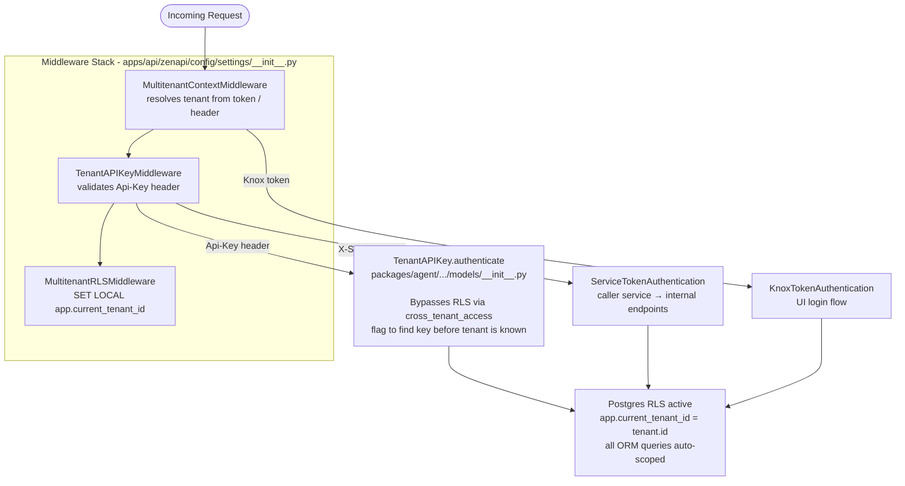

---

## 2. ElevenLabs Integration

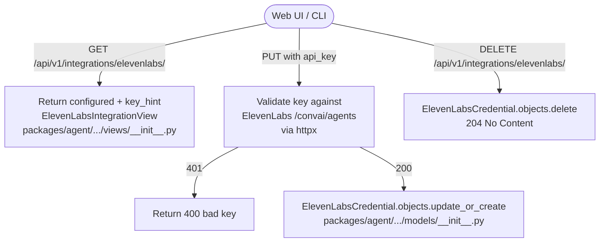

---

## 3. Agent Listing & ElevenLabs Sync

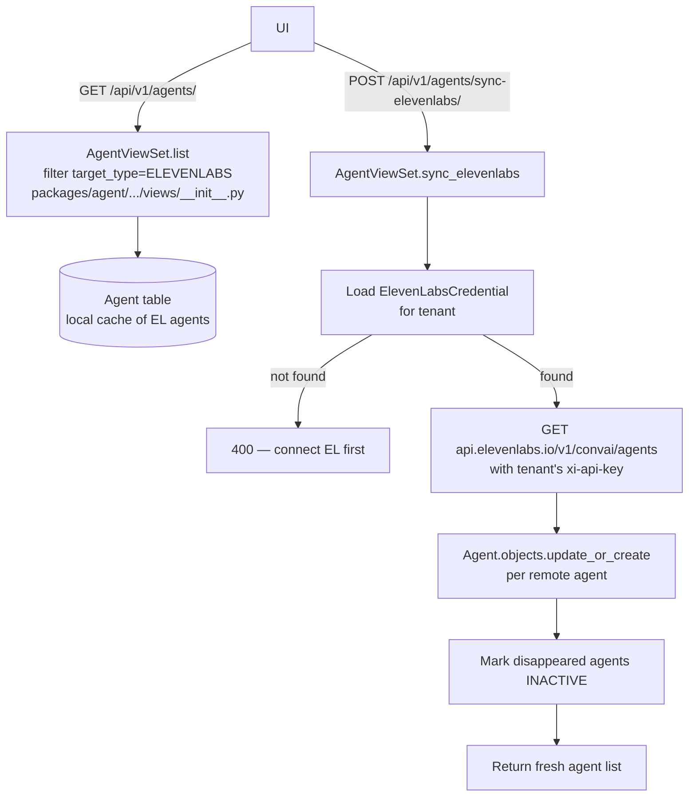

---

## 4. Scenario CRUD

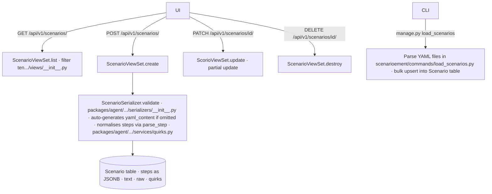

---

## 5. Test Run Creation

### 5a. Single Run

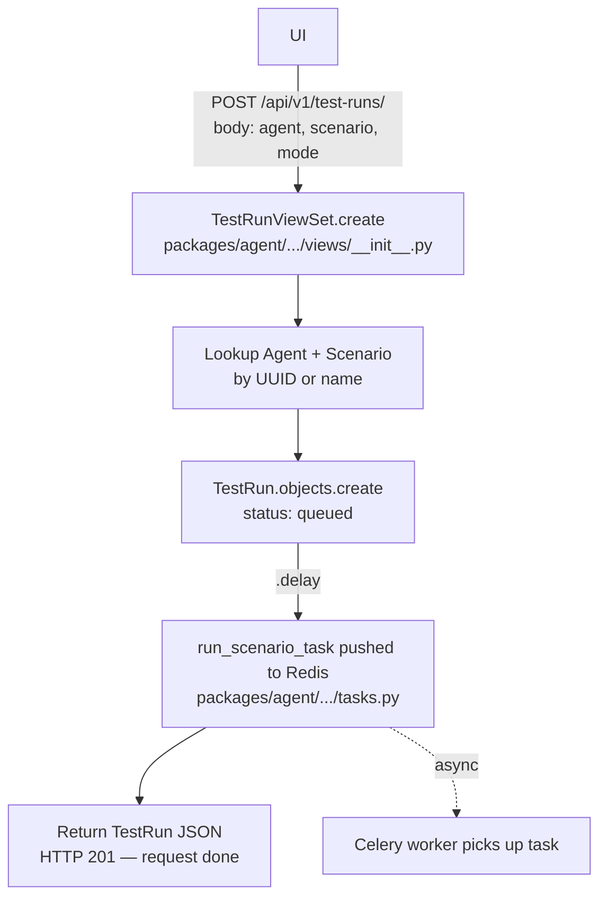

### 5b. Bulk Run — run-evals

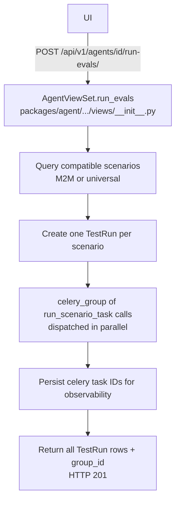

---

## 6. Text Mode Call Flow (BUILTIN agents) — Synchronous inside Celery

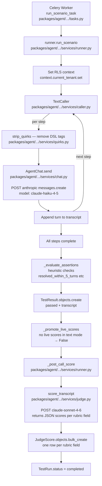

---

## 7. Remote Mode Call Flow (ELEVENLABS agents) — Mixed sync + async

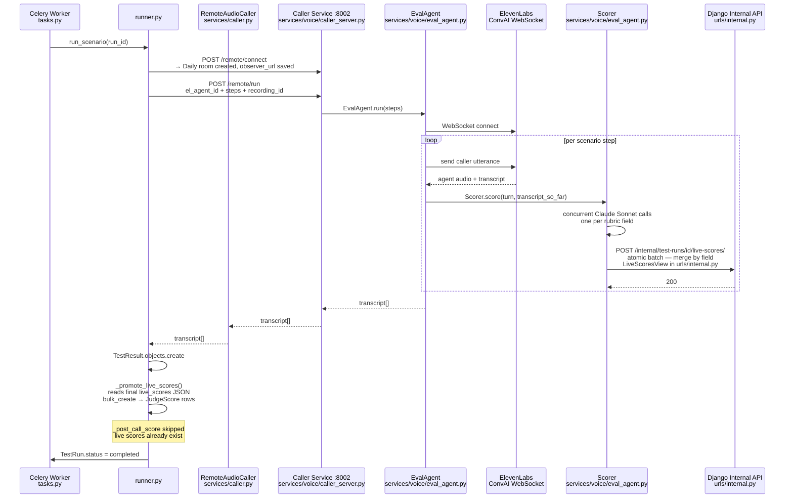

---

## 8. Internal Endpoints (Caller → Django only)

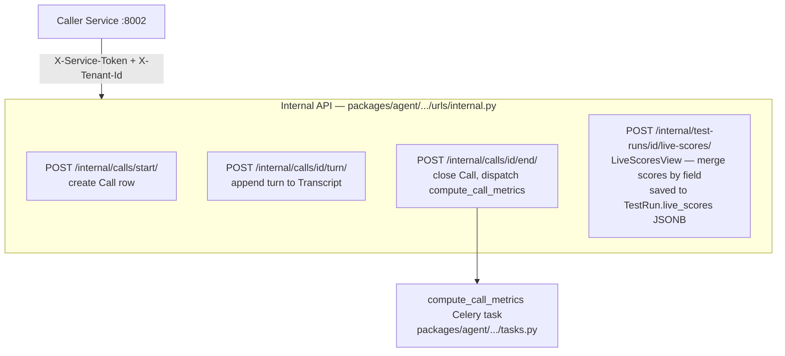

---

## 9. 3-Tier Verdict System

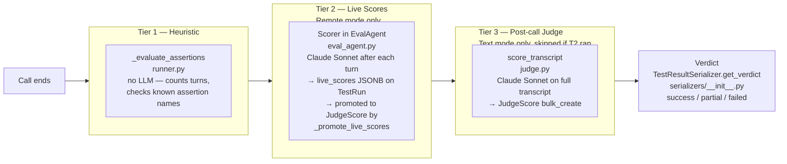

---

## 10. Web UI Data Flow

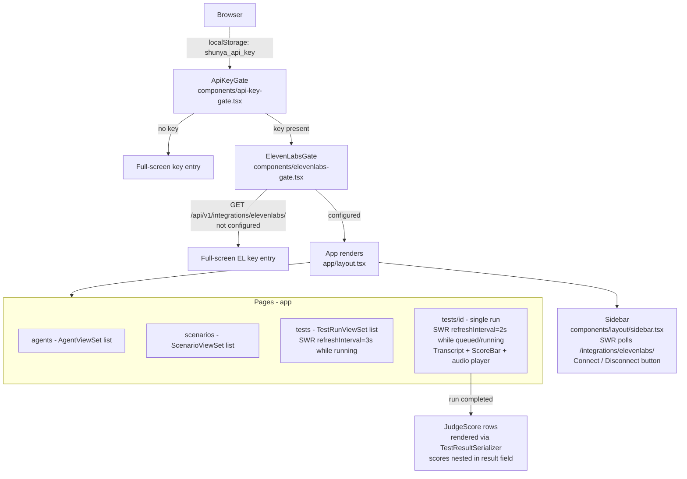

---

## File Map Quick Reference

| Area | Key File |
|---|---|
| RLS multi-tenancy | `packages/mt/src/zenlib/reusable_apps/multitenant/models.py` |
| Auth middleware | `apps/api/zenapi/config/settings/__init__.py` |
| All tenant models | `packages/agent/.../voice_qa/models/__init__.py` |
| All public views | `packages/agent/.../voice_qa/views/__init__.py` |
| Internal endpoints | `packages/agent/.../voice_qa/urls/internal.py` |
| Serializers | `packages/agent/.../voice_qa/serializers/__init__.py` |
| Celery tasks | `packages/agent/.../voice_qa/tasks.py` |
| Scenario runner | `packages/agent/.../voice_qa/services/runner.py` |
| Text caller + AgentChat | `packages/agent/.../voice_qa/services/caller.py` + `chat.py` |
| Voice Quirks DSL | `packages/agent/.../voice_qa/services/quirks.py` |
| Post-call judge | `packages/agent/.../voice_qa/services/judge.py` |
| Caller HTTP server | `services/voice/caller_server.py` |
| EvalAgent + Scorer | `services/voice/eval_agent.py` |
| Next.js entry | `services/web/app/layout.tsx` |
| API fetch wrapper | `services/web/lib/api.ts` |
| TS types | `services/web/lib/types.ts` |
